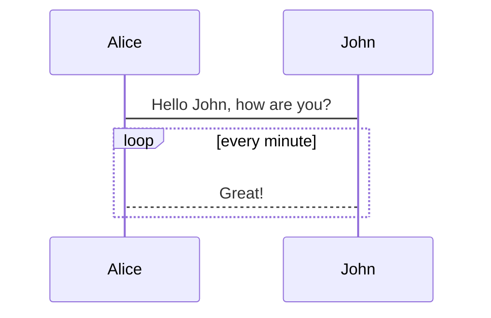

# Vuepress

## 常用插件

### mermaidjs

[vuepress-plugin-mermaidjs](https://github.com/eFrane/vuepress-plugin-mermaidjs)是一款markdown流程图插件

#### 示例



#### 使用

使用下面命令安装
```shell
npm install --save-dev vuepress-plugin-mermaidjs
```
或
```
yarn add -D vuepress-plugin-mermaidjs
```
然后在`.vuepress/config.js`中添加插件配置
``` js
module.exports = {
    // ...
    plugins: [
        'mermaidjs'
    ]
    // ...
}
```

### flowchart

[vuepress-plugin-flowchart](https://github.com/ulivz/vuepress-plugin-flowchart) 是一款markdown流程图插件

#### 示例
@flowstart
st=>start: Start|past:>http://www.google.com[blank]
e=>end: End|future:>http://www.google.com
op1=>operation: My Operation|past
op2=>operation: Stuff|current
sub1=>subroutine: My Subroutine|invalid
cond=>condition: Yes
or No?|approved:>http://www.google.com
c2=>condition: Good idea|rejected
io=>inputoutput: catch something...|future

st->op1(right)->cond
cond(yes, right)->c2
cond(no)->sub1(left)->op1
c2(yes)->io->e
c2(no)->op2->e
@flowend
